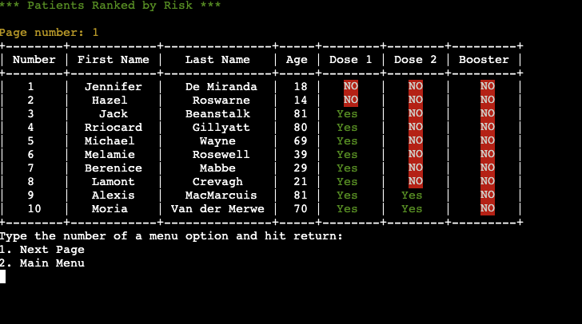

# **Vaccination Manager**

## **Overview**

Vaccination Manager is a simplified version of management software that might be used by a medical practice. It is designed to record the personal details of patients and track their record of vaccination. 

It is presented as a text-based interface in a terminal hosted on Heroku. Users can input new patients, edit their history and delete their records from the system. The software stores patient data on Google Sheets spreadsheets via an API. These records can be processed and analysed. For example, patients can be ranked according to their vaccination records and age to determine risk. In a medical practice this would help prioritise and contact patients. 

This project is designed to fulfil the requirements of the Code Institute Portfolio 3 Submission.

The live website can be found [here](https://vaccination-patient-manager.herokuapp.com/).
 

 
## Table of Contents
* [Overview](#wireframes)
* [How to Use](#wireframes)
* [Planning](#wireframes)
* [Data Model](#wireframes)
* [OOP Principles and Data Model](#)
* [Flow of Control](#wireframes)
* [Testing](#wireframes)
* [Third Party Libraries](#wireframes)
* [Features](#Features)
* [Future Features](#possible-future-features)
* [Technologies Used](#Technologies-Used)
* [Testing](#Testing)
* [Validation Testing](#validation-testing)
* [Deployment](#deployment)
* [Credits](#credits)
* [Acknowledgements](#acknowledgements)

## Initial Planning

### Goals
* To present a simple, easy-to-grasp text interface with a clear logical flow
* Make the purpose and operation of the software clear 
* Provide feedback and guidance on user actions
* Gracefully handle user input and ensure data is recorded correctly
* Operate continuously in a loop without crashing

### Logical Flow

I created this chart to map out the flow of control through the program and help me understand where to direct the various functions.
 

# Features

## Main Menu
This is the home screen and main menu
* Simple, numbered menu options.
* Colourful ASCII art title.
* Only 1-5 accepted from keyboard, all other input is rejected.  
  

## User Guide 
* Gives the user an overview of the function of the software
* Explains menu options
* Coloured text to highlight information
* User can easily return to main menu.

## View At Risk Patients  
* Shows a table view of patient records
* Sorted by vaccine status and then by age to determine risk
* Contrast colours highlight actionable cases
* Menu options to go forward and back through pages of records
  

## View All Patients  
* Alphabetically sorted list of all patients
* Offers user option to edit or delete a record
* User types in number of record from left-hand column and can then make and edit or deletion
* Software confirms whether or not you want to make these changes, if not you return to the main menu
  

## Add New Patient  
* List of guided questions to input new patient
* Answers validated to prevent incorrect data
* Some questions are sequential, so if you missed first vaccine you won't be asked about follow-up shots, as they are dependent on receiving the first one.
* Message displayed on successful addition of patient. In case of a problem with the API, an error message will be displayed.
  

## Progress Dashboard  
* Bar chart showing how many of the current patients have been vaccinated to each level.
* Will update as patient records change over time.
* Created using external library.
  

## Update Patient 
* Select a current patient and update their vaccine history through series of prompts.
* Similar to when creating new user, questions are nested.
  

## Delete Patient 
* User selects patient via number on left-hand column
* The system confirms that a deletion is requested, otherwise returns to the main  menu
* A confirmation is displayed if the deletion was effective.
  

## User Input and Validation

In a text-based software project, it is a bigger concern that input coming from the user through the keyboard is handled correctly. For this program, I used an external library called PyInputPlus. This has a number of advantages:
* Prompts can be shown to the user which only accept a certain range of inputs. For example, to record the month part of a date of birth, then only an integer between 1 and 12 should be accepted. This makes it easier to work with data inside the program when we know it is within certain parameters.
* The same library can display a menu of numbered options and keep looping until a valid selection is made. This helps to make the code less verbose instead of handling every menu and validation manually.

## OOP and Data Model

This project was designed using Object Oriented Principles in mind. Here is an overview of the classes used to create the site:
### Clinic class
* This is the overall management class for the app, it takes in the data on loading, and also presents menu options to the user. It has helper functions to display data, clear the screen, create and edit patient records. It also sorts and filters the data in order to present it to the user.
### Patient class
* This represents the individual patient kept track of by the clinic. This class has a unique 6 digit ID, and attributes showing personal details and vaccination records. It has a method which calculates their age based on today's date and returns it to the Clinic class for sorting.
### Table View class
* The main functionality of this program is in presenting pages of patient records to the user. Rather than printing long lists which require scrolling, I wanted to allow the user to page forward and back through a table. This class takes in data and prints out a slice of it in table form based on which page number is currently selected. This allows the program menu to show data and options that properly persist over time rather than being reset.

## Possible Future Features

### Full Search
* Currently the user browses through the list of patient names and selects via number which record they want to update or delete. If the number of records were larger it would be useful to implement full search capabilities. This would probably require a proper database package rather than using Google Sheets for data storage.
### Email Contact
* If a field for email addresses was added to the patient data, then it would be possible to email users to arrange appointments or discussion. These emails could be programatically sent out through the Heroku server or via Zapier automation integrations. There are possible concerns about email deliverability when sending from your own server or free hosting.

## Third Party Libraries Used

After looking at a number of projects of this type, there are a few factors that seem to contribute to extra code and clutter. The first is storing large strings of ASCII graphics to be printed out in the terminal. The second is validating user input for any interaction through the terminal. For this reason I have used the following libraries as part of my project.

* [Pyfiglet](https://github.com/pwaller/pyfiglet) - This library allows you to generate ASCII titles and text on the fly. You call the library on any piece of text and a string is returned which generates text effects when printed out to the terminal. For example, the word 'Dashboard' is rendered like this:  

* [PyInputPlus](https://pypi.org/project/PyInputPlus/) - Designed to handle user input validation, this library lets you offer a number of different prompts for menus, yes/no questions, integers etc. You can restrict the range of acceptable data and make sure that user data is sanitised before processing it in your program.

Other libraries used include:
* [PrettyTable](https://github.com/jazzband/prettytable) - printing lists of names can be difficult to format correctly. This library handles constructing the table and printing it in a pleasing layout, while also letting you set maximum widths for certain columns which is important when outputting to a terminal.
* [Termcolor](https://pypi.org/project/termcolor/) allows the use of colours in text output on the terminal. This was used to highlight menu options and make the interface more visually appealing.
* [Plotext](https://github.com/piccolomo/plotext) is a library that generates charts and plotting graphics. This was implemented on the dashboard page of the project, taking overall data on patient vaccination rates and showing it as a bar chart.
* Gspread / Google Auth - these were used to set up the connection to Google Sheets. The spreadsheet was used to store the user records, and these APIs were used to read, edit and delete data.

## Technologies Used
* Python 
    * The entirety of this project was written in the Python language.
* [Github](https://github.com) 
    * GitHub is used to host the source code of the project.
* [Gitpod](https://gitpod.io) 
    * Gitpod was the development environment for this site and linked to Github for storage and deployment.
* [MacOS Preview](https://support.apple.com/guide/preview/welcome/mac)
    * This program was used to capture and edit screenshots of the site.
* [Heroku](https://dashboard.heroku.com/)
    * Used as a server for the project once deployed.
* [LucidChart](https://www.lucid.app/)
    * For creating charts and flow diagrams.
* [PEP8](http://pep8online.com/)
    * Python code validation service.

## Validation Testing
* Python: All code was tested using the [PEP8 Validator](http://pep8online.com/). The code shows no errors and no warnings. Most of the initial warnings that required fixing were about keeping all code within the 80 character limit.

### Development Issues
* When I initially designed the interface of the program, I had planned to use emoji symbols such as ✅ when presenting information to the user. However, while this worked well on the GitPod development environment, it caused problems when deployed to Heroku. It seems the terminal printed these characters with a slightly different width which caused all of the tables to be slightly misaligned. I tested a number of libraries for printing and formatting rich text but could not fix this problem before the deadline and reverted to using coloured text.

# Deployment

## Creating the Project
1. A new repository was created for the project on GitHub by clicking 'New Repository' on the GitHub user page, giving a name to the project.
1. The GitPod link created by the Chrome extension was clicked on the Code Institute Python template found [here](https://github.com/Code-Institute-Org/python-essentials-template).
1. This created a virtual workspace which was linked to my GitHub account.
1. After writing code for the project, I used git commands add, commit and push which sent all the project files from GitPod to my GitHub repository.

## Deploying to Heroku
The project was deployed on the Heroku site by using these steps:
1. Log into Heroku after creating a user account if necessary.
1. Select the 'New' button and click 'Create New App'.
1. Choose a unique name for your app.
1. Add the buildpacks for Python and NodeJS from the settings page for your project. They must be added in this order.
1. Add the configuration variables for your app on the settings page. These include PORT=8000 and the credentials used for your API access.
1. On the settings page, click the 'Deploy' tab.
1. Select GitHub as the method for deployments.
1. Sign in when prompted with your GitHub login and search for the repository for your project.
1. Click the correct repository and click 'Connect'.
1. Under the deployment type section, you can choose between automatic deployment whenever you push updated code to GitHub, or manual deployment where you must confirm that you want the site updated.

## Local Deployment

#### Forking the repo on GitHub
1. Log into your GitHub account.
1. Navigate to the project page found [here](https://github.com/neil314159/portfolio-project-3).
1. Click the 'Fork' icon on the upper right hand side of the screen.
1. This action copies the code into your own repo so you can examine and edit it in the development environment of your choice.

#### Cloning to Gitpod
1. Install the Google Chrome Gitpod plugin found [here](https://chrome.google.com/webstore/detail/gitpod-always-ready-to-co/dodmmooeoklaejobgleioelladacbeki).
1. Navigate to the project repository page [here](https://github.com/neil314159/portfolio-project-3).
1. Click the green GitPod button on the top right of the screen.
1. This will open the project in a virtual GitPod workspace.
1. Install the required libraries by executing the command 'pip3 install -r requirements.txt' in your GitPod terminal.

#### Download a zip file of the source code
1. Click this [link](https://github.com/neil314159/portfolio-project-3) to the project home page.
1. Click the 'Code' button on the right hand side.
1. Select "Download Zip'
1. Decompress the files on your own machine.
1. Open them in your local IDE such as VSCode.

# Credits
* Mock user data including names and dates of birth were generated on the website [Mockaroo](https://www.mockaroo.com).
* The techniques for connecting to the Google Sheets spreadsheets via API were taken from the Code Institute training materials.
* The table view required some code to iterate over a slice of a list while maintaining a proper index, this was inspired by [this question](https://stackoverflow.com/questions/23159254/python-slices-of-enumerate) on StackOverflow.
* The [documentation](https://github.com/piccolomo/plotext/blob/master/readme/bar.md) for the Plotext library was used to construct the bar chart on the dashboard page.
* The idea of counting Boolean values by simply adding them to quickly sort a list was shown in [this answer](https://stackoverflow.com/questions/16455777/python-count-elements-in-a-list-of-objects-with-matching-attributes#comment23606447_16455812) on StackOverflow.
* The [documentation](https://github.com/jazzband/prettytable) for the PrettyTable library showed how to construct and print properly formatted data.

## Acknowledgements
Thanks to Daisy McGirr for her advice and guidance.